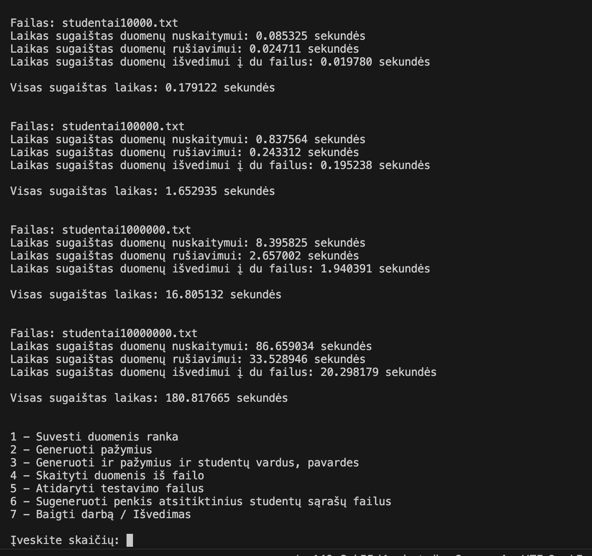

# v0.4
Laboratinio darbo nr. 1 v.0.4 versija

1. Nuskaito duomenis iš naudotojo arba failo ir patikrina ar jie yra teisingi (naudojant išimčių valdymą). 
2. Duoda naudotojui galimybė pasirinkti du galutinio balo skaičiavimo būdus - skaičiuojant vidurkį ar medianą.
3. Leidžia pasirinkti 5 skirtingus būdus įvesti, nuskaityti ar sugeneruoti duomenis.
4. Dinamiškai paskiria atmintį pagal įvesta / nuskaitytą duomenų kiekį.
5. Atidaro testavimo failus ir apskaičiuoja laiką, kurį praleidžia apdorojant duomenis iš failų.
6. Visi pranešimai išvedami lietuvių kalbą.
7. Projektas išskaidytas į kelis failus (.h ir .cpp).
8. Generuoja penkis atsitiktinius studentų sąrašų failus, sudarytus iš: 1 000, 10 000, 100 000, 1 000 000, 10 000 000 įrašų
9. Atlieka tyrimus / testavimus su sugeneruotais failais.
10. Surūšiuoja studentus ir išveda į du naujus failus.

## Tyrimo rezultatai

| Failo dydis | Skaitymo laikas  | Rūšiavimo laikas | Išvedimo laikas  |
|-------------|------------------|------------------|------------------|
| 1 000       | 0.002s           | 0.001s           | 0.001s           |
| 10 000      | 0.085s           | 0.024s           | 0.019s           |
| 100 000     | 0.837s           | 0.243s           | 0.195s           |
| 1 000 000   | 8.395s           | 2.657s           | 1.940s           |
| 10 000 000  | 86.659s          | 33.528s          | 20.298s          |

