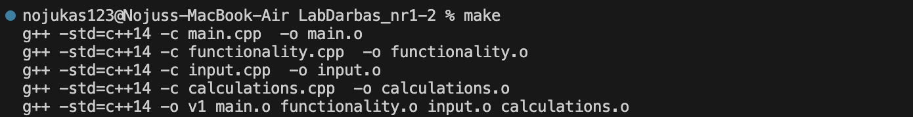
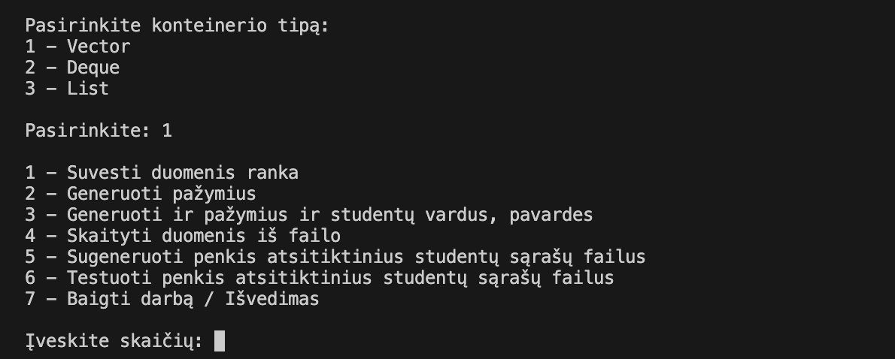
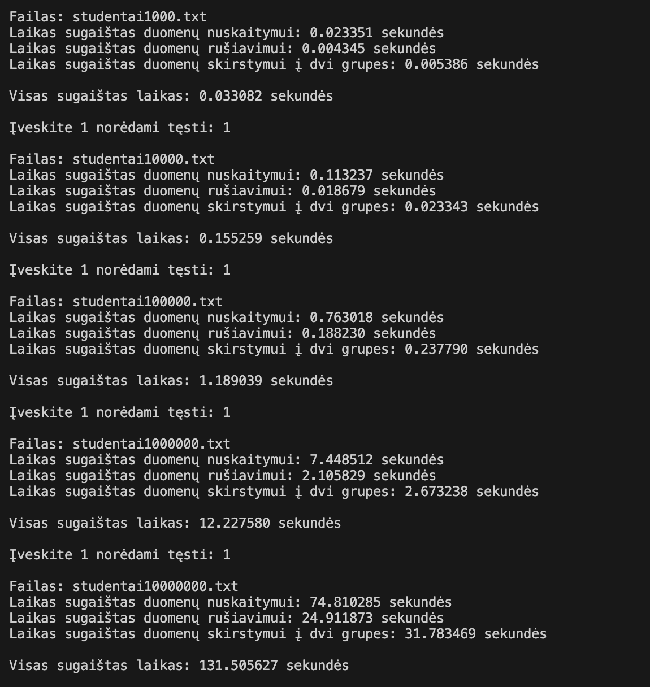
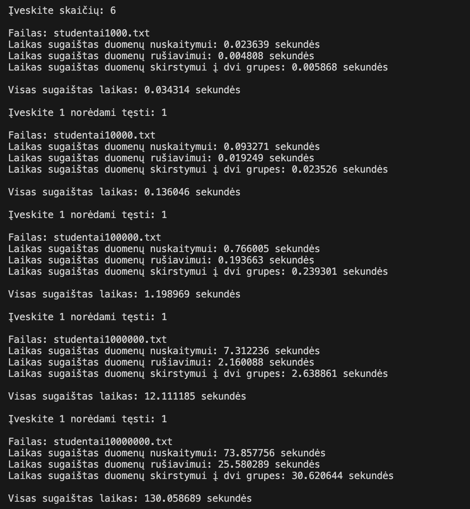
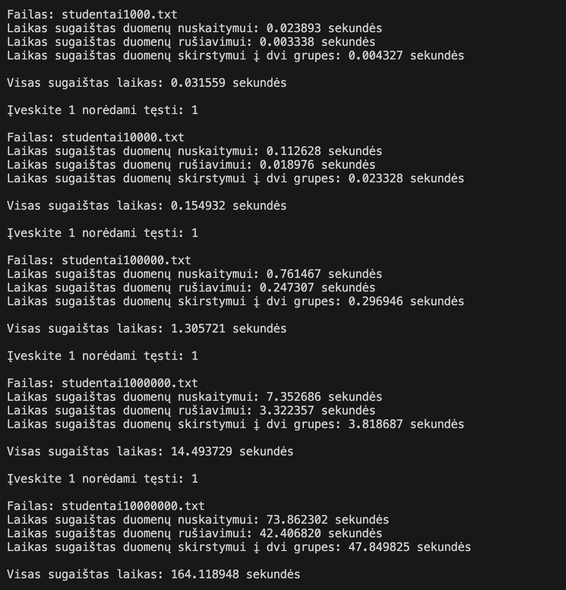
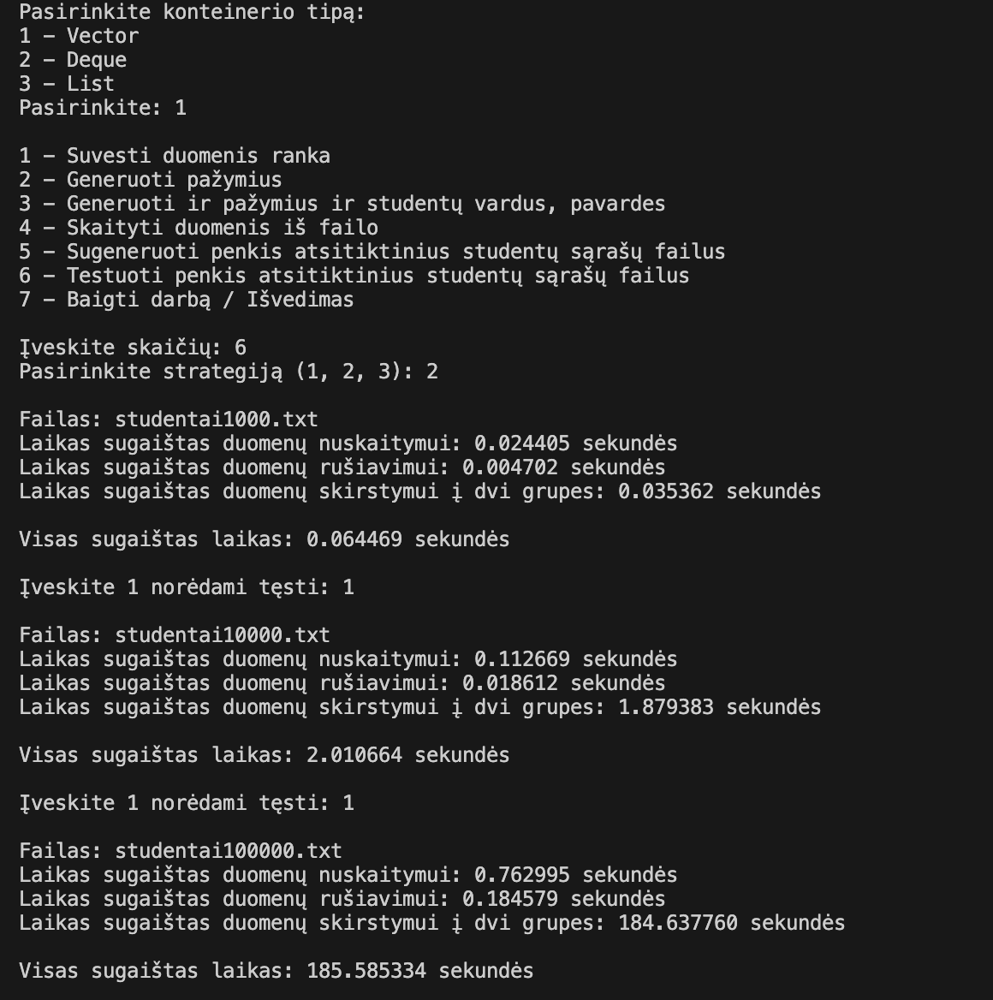
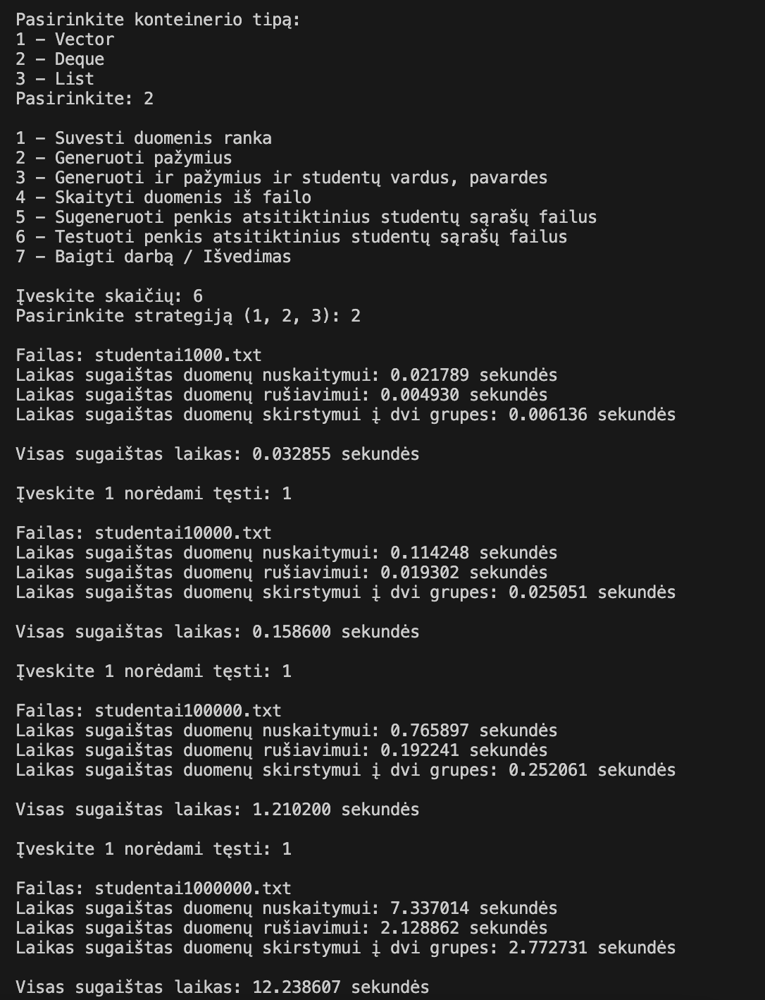
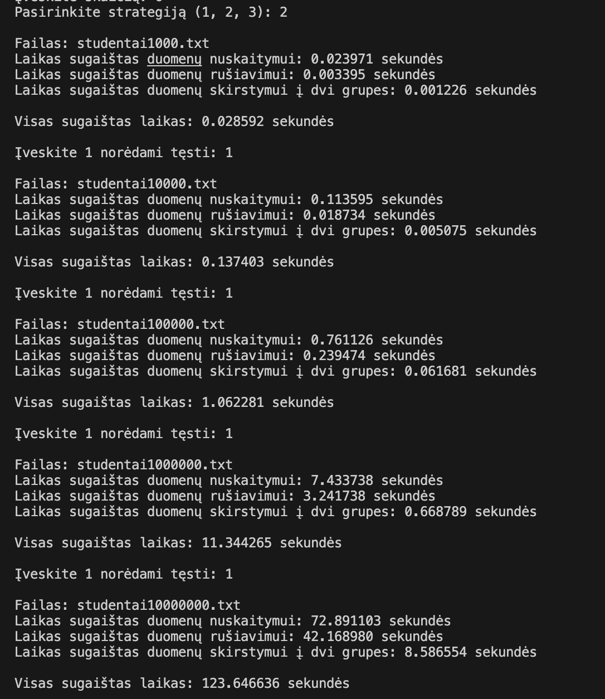
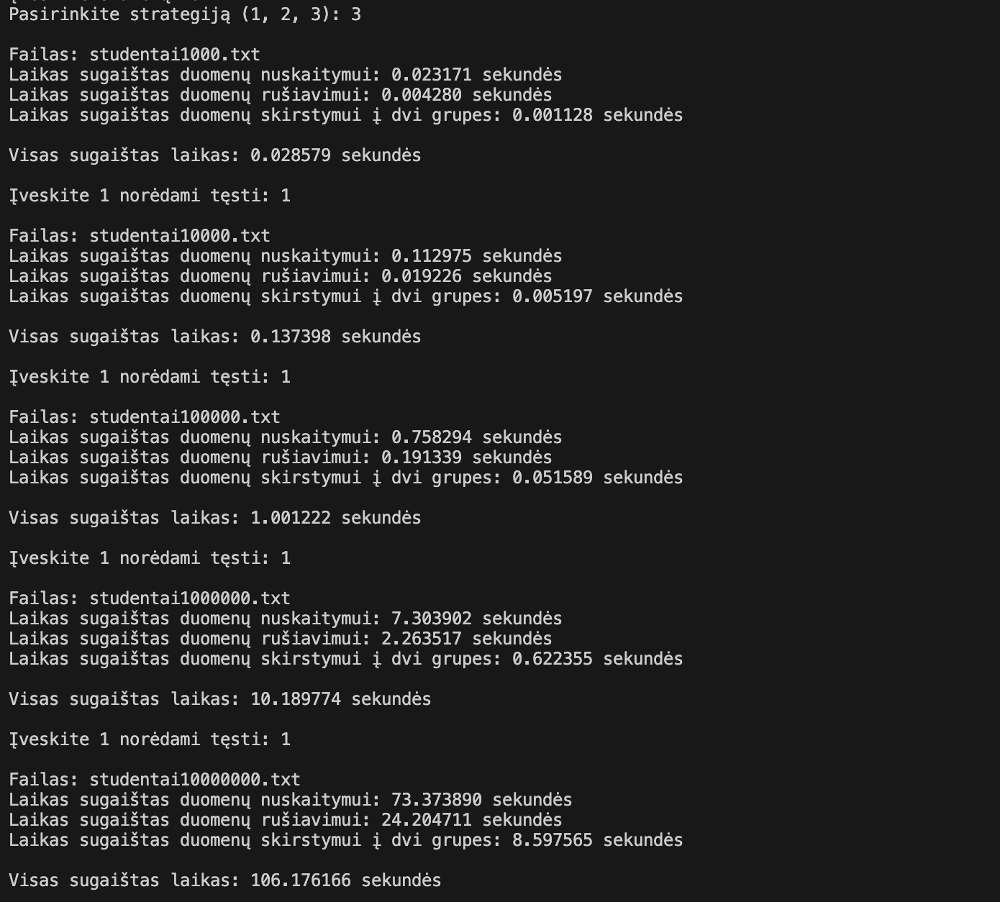

# v1.0

## Diegimo instrukcija

- Atsisiųskite projekto kodą iš GitHub naudodami `git clone` komandą su projekto URL:
```
git clone https://github.com/nojusta/LabDarbas_nr1
```

- Pereikite į projekto katalogą naudodami cd komandą. Pavyzdžiui:

```
cd *projekto vieta kompiuteryje*
```

- Sukurkite Makefile su reikiamomis taisyklėmis. Jūsų Makefile turėtų atrodyti maždaug taip (Unix OS atveju):

```makefile
# Kompiliatorius
CXX = g++

# Kompiliatoriaus parametrai
CXXFLAGS = -std=c++14

# Vykdymo failo pavadinimas
TARGET = v1

# Šaltinio failai
SRCS = main.cpp functionality.cpp input.cpp calculations.cpp

# Objektų failai
OBJS = $(SRCS:.cpp=.o)

# Taisyklė programa susieti
$(TARGET): $(OBJS)
    $(CXX) $(CXXFLAGS) -o $(TARGET) $(OBJS)

# Taisyklė kompiliuoti šaltinio failus
.cpp.o:
    $(CXX) $(CXXFLAGS) -c $<  -o $@

# Taisyklė išvalyti tarpinius failus
clean:
    $(RM) $(OBJS)

# Taisyklė išvalyti viską
distclean: clean
    $(RM) $(TARGET)
```
- Sukompiliuokite programą naudodami make komandą:
```
make
```
Tada gausite tokį rezultatą:  



- Paleiskite programą naudodami šią komandą:
```
./v1
```

### Valymo instrukcija

- Jei norite išvalyti sukompiliuotus failus, galite naudoti šias make komandas:
```
make clean
make distclean
```

## Naudojimosi instrukcija

- Paleiskite programą naudodami šią komandą:
```
./v1
```
- Programa pateiks meniu su įvairiomis funkcijomis. Pasirinkite funkciją įvedę atitinkamą numerį ir spauskite `Enter`.



### Programos funkcijos:
  - Nuskaito duomenis iš naudotojo arba failo ir patikrina ar jie yra teisingi (naudojant išimčių valdymą). 
  - Duoda naudotojui galimybė pasirinkti du galutinio balo skaičiavimo būdus - skaičiuojant vidurkį ar medianą.
  - Leidžia pasirinkti 5 skirtingus būdus įvesti, nuskaityti ar sugeneruoti duomenis.
  - Dinamiškai paskiria atmintį pagal įvesta / nuskaitytą duomenų kiekį.
  - Atidaro testavimo failus ir apskaičiuoja laiką, kurį praleidžia apdorojant duomenis iš failų.
  - Visi pranešimai išvedami lietuvių kalbą.
  - Projektas išskaidytas į kelis failus (.h ir .cpp).
  - Generuoja penkis atsitiktinius studentų sąrašų failus, sudarytus iš: 1 000, 10 000, 100 000, 1 000 000, 10 000 000 įrašų
  - Atlieka tyrimus / testavimus su sugeneruotais failais.
  - Surūšiuoja studentus ir išveda į du naujus failus.
  - Yra 3 skirtingi konteinerio tipo pasirinkimai testavimui - vector, deque, list.
  - Yra 3 skirtingos strategijos duomenų skirstymui.
- Norėdami baigti darbą su programa, pasirinkite atitinkamą skaičių.

## Konteinerių testavimas

### Testavimo sistemos parametrai:

- Saugykla: 256 GB, Integruota NVMe SSD
- Atmintis: 8 GB RAM
- Procesorius: Apple M1

## 1 strategija

### Naudojant Vector tipo konteinerius:

| Failo dydis | Skaitymo laikas  | Rūšiavimo laikas | Skirstymo laikas | Veikimo laikas |
|-------------|------------------|------------------|------------------|----------------|
| 1 000       | 0.023s           | 0.004s           | 0.005s           | 0.033s         |
| 10 000      | 0.113s           | 0.018s           | 0.023s           | 0.155s         |
| 100 000     | 0.763s           | 0.188s           | 0.237s           | 1.189s         |
| 1 000 000   | 7.448s           | 2.105s           | 2.673s           | 12.227s        |
| 10 000 000  | 74.810s          | 24.911s          | 31.783s          | 131.505s       |

<details>
  <summary>peržiūrėti</summary>
  
  
</details>

### Naudojant Deque tipo konteinerius:

| Failo dydis | Skaitymo laikas  | Rūšiavimo laikas | Skirstymo laikas | Veikimo laikas |
|-------------|------------------|------------------|------------------|----------------|
| 1 000       | 0.023s           | 0.004s           | 0.005s           | 0.034s         |
| 10 000      | 0.093s           | 0.019s           | 0.023s           | 0.136s         |
| 100 000     | 0.766s           | 0.193s           | 0.239s           | 1.198s         |
| 1 000 000   | 7.312s           | 2.160s           | 2.638s           | 12.111s        |
| 10 000 000  | 73.857s          | 25.580s          | 30.620s          | 130.058s       |

<details>
  <summary>peržiūrėti</summary>
  
  
</details>

### Naudojant List tipo konteinerius:

| Failo dydis | Skaitymo laikas  | Rūšiavimo laikas | Skirstymo laikas | Veikimo laikas |
|-------------|------------------|------------------|------------------|----------------|
| 1 000       | 0.023s           | 0.003s           | 0.004s           | 0.031s         |
| 10 000      | 0.112s           | 0.018s           | 0.023s           | 0.154s         |
| 100 000     | 0.761s           | 0.247s           | 0.296s           | 1.305s         |
| 1 000 000   | 7.352s           | 3.322s           | 3.818s           | 14.493s        |
| 10 000 000  | 73.862s          | 42.406s          | 47.849s          | 164.118s       |

<details>
  <summary>peržiūrėti</summary>
  

</details>

## 2 strategija

### Naudojant Vector tipo konteinerius:

| Failo dydis | Skaitymo laikas  | Rūšiavimo laikas | Skirstymo laikas | Veikimo laikas |
|-------------|------------------|------------------|------------------|----------------|
| 1 000       | 0.024s           | 0.004s           | 0.035s           | 0.064s         |
| 10 000      | 0.112s           | 0.018s           | 1.879s           | 2.010s         |
| 100 000     | 0.762s           | 0.184s           | 184.637s         | 184.637s       |

<details>
  <summary>peržiūrėti</summary>
  
  
</details>

- Rezultatų su 1 000 000 ir 10 000 000 nėra, nes per ilgai trunka skaičiavimai (>10min).

### Naudojant Deque tipo konteinerius:

| Failo dydis | Skaitymo laikas  | Rūšiavimo laikas | Skirstymo laikas | Veikimo laikas |
|-------------|------------------|------------------|------------------|----------------|
| 1 000       | 0.021s           | 0.004s           | 0.006s           | 0.032s         |
| 10 000      | 0.114s           | 0.019s           | 0.025s           | 0.158s         |
| 100 000     | 0.765s           | 0.192s           | 0.252s           | 1.210s         |
| 1 000 000   | 7.337s           | 2.128s           | 2.772s           | 12.238s        |

<details>
  <summary>peržiūrėti</summary>
  
  
</details>

- Rezultatų su 10 000 000 nėra, nes per ilgai trunka skaičiavimai (>10min).

### Naudojant List tipo konteinerius:

| Failo dydis | Skaitymo laikas  | Rūšiavimo laikas | Skirstymo laikas | Veikimo laikas |
|-------------|------------------|------------------|------------------|----------------|
| 1 000       | 0.023s           | 0.003s           | 0.001s           | 0.028s         |
| 10 000      | 0.113s           | 0.018s           | 0.005s           | 0.137s         |
| 100 000     | 0.761s           | 0.239s           | 0.061s           | 1.062s         |
| 1 000 000   | 7.433s           | 3.324s           | 0.668s           | 11.344s        |
| 10 000 000  | 72.891s          | 42.406s          | 8.586s           | 123.646s       |

<details>
  <summary>peržiūrėti</summary>
  
  
</details>

## 3 strategija

### Naudojant Vector tipo konteinerius:

| Failo dydis | Skaitymo laikas  | Rūšiavimo laikas | Skirstymo laikas | Veikimo laikas |
|-------------|------------------|------------------|------------------|----------------|
| 1 000       | 0.023s           | 0.004s           | 0.001s           | 0.033s         |
| 10 000      | 0.112s           | 0.019s           | 0.005s           | 0.155s         |
| 100 000     | 0.758s           | 0.191s           | 0.051s           | 1.189s         |
| 1 000 000   | 7.303s           | 2.263s           | 0.622s           | 12.227s        |
| 10 000 000  | 73.373s          | 24.204s          | 8.597s           | 131.505s       |

<details>
  <summary>peržiūrėti</summary>
  
  
</details>

## Išvados

Remiantis atliktų testų rezultatais, galime padaryti keletą išvadų:

1. **Vector tipo konteineriai**: Vector tipo konteineriai parodė geriausius rezultatus su mažesniais failais. Tačiau, kai studentų kiekis padidėjo iki 1 000 000 ir 10 000 000, Vector tipo konteinerių veikimo laikas žymiai padidėjo, naudojant antrąją strategiją, kuri yra neefektyvi su šiuo konteineriu tipu. Pirmoji ir trečioji strategija parodė greičiausius rezultatus.

2. **Deque tipo konteineriai**: Deque tipo konteineriai parodė panašius rezultatus kaip ir Vector tipo konteineriai. Tačiau, jie buvo šiek tiek greitesni su didesniais failų dydžiais. Kaip ir su vektoriais, antroji strategija buvo neefektyvi.
   
3. **List tipo konteineriai**: List tipo konteineriai parodė geriausius rezultatus su didesniais failų dydžiais. Jie buvo ypač efektyvūs naudojant antrąją strategiją.

Bendra išvada yra, kad konteinerio tipo ir strategijos pasirinkimas gali turėti didelę įtaką programos veikimo laikui, ypač dirbant su didelėmis duomenų apimtimis.
  
## Senesnių versijų aprašymai

- v.pradinė: Pradinė versija. Nuskaito vartotojo įvestį, patikrina ją, leidžia vartotojui pasirinkti tarp dviejų galutinio balo skaičiavimo būdų (vidurkis ar mediana), ir išveda duomenis ekrane.

- v0.1: Prideda galimybę pasirinkti iš 4 skirtingų būdų įvesti arba generuoti duomenis / baigti programą. Dinamiškai paskiria atmintį pagal įvestų duomenų kiekį. Išveda duomenis ekrane.

- v0.2: Prideda galimybę skaityti duomenis iš failo. Leidžia vartotojui pasirinkti iš 5 skirtingų būdų įvesti, skaityti arba generuoti duomenis. Dinamiškai skiria atmintį pagal įvestą / nuskaitytą duomenų kiekį. Atidaro testavimo failus ir apskaičiuoja laiką, kurį praleidžia apdorojant duomenis iš failų. Išveda duomenis pasirinktinai ekrane arba faile.

- v0.3: Prideda išimčių valdymą duomenų nuskaitymui. Visi pranešimai išvedami lietuvių kalba. Projektas išskaidytas į kelis failus (.h ir .cpp).

- v0.4: Prideda galimybę generuoti penkis atsitiktinius studentų sąrašų failus, sudarytus iš: 1 000, 10 000, 100 000, 1 000 000, 10 000 000 įrašų. Atlieka tyrimus / testavimus su sugeneruotais failais. Surūšiuoja studentus ir išveda į du naujus failus.

- v1.0_pradinė: Prideda 3 skirtingus konteinerio tipo pasirinkimus testavimui - vector, deque, list.
  
