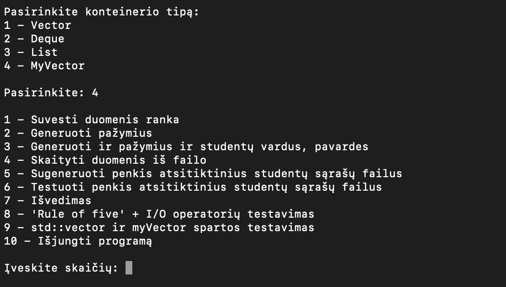
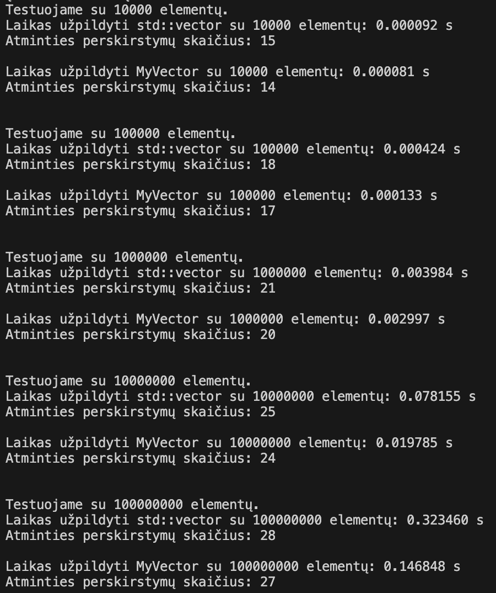

# v3.0

## Diegimo instrukcija

- Atsisiųskite projekto kodą iš GitHub naudodami `git clone` komandą su projekto URL:
```
git clone https://github.com/nojusta/OOP_Lab3
```

- Pereikite į projekto katalogą naudodami cd komandą. Pavyzdžiui:

```
cd *projekto vieta kompiuteryje*
```

- Sukurkite Makefile su reikiamomis taisyklėmis. Jūsų Makefile turėtų atrodyti maždaug taip (Unix OS atveju):

```makefile
# Kompiliatorius
CXX = g++

# Kompiliatoriaus parametrai
CXXFLAGS = -std=c++20 -O3 -mmacosx-version-min=14.3

# Vykdomo failo pavadinimas
TARGET = v3

# Source failai
SRCS = main.cpp functionality.cpp input.cpp calculations.cpp student.cpp

# Object failai
OBJS = $(SRCS:.cpp=.o)

# Google Test biblioteka
GTEST = /usr/local/lib/libgtest.a /usr/local/lib/libgtest_main.a

# Bibliotekos
LIBS = $(GTEST)

# Testuojami failai
TEST_SRCS = myVector_test.cpp student_test.cpp

# Testuojami objekto failai
TEST_OBJS = $(TEST_SRCS:.cpp=.o)

# Testuojamo failo pavadinimas
TEST_TARGET = myVector_test student_test

# Taisyklė programa susieti
$(TARGET): $(OBJS)
	$(CXX) $(CXXFLAGS) -o $(TARGET) $(OBJS)

# Taisyklė testams susieti
myVector_test: student.o myVector_test.o
	$(CXX) $(CXXFLAGS) -o myVector_test student.o myVector_test.o $(LIBS)

student_test: student.o student_test.o
	$(CXX) $(CXXFLAGS) -o student_test student.o student_test.o $(LIBS)

# Taisyklė kompiliuoti failus
.cpp.o:
	$(CXX) $(CXXFLAGS) -c $<  -o $@

# Taisyklė išvalyti tarpinius failus
clean:
	$(RM) $(OBJS) $(TEST_OBJS)

# Taisyklė išvalyti viską
distclean: clean
	$(RM) $(TARGET) myVector_test student_test

```
- Sukompiliuokite programą naudodami make komandą:
```
make
```
Tada gausite tokį rezultatą:  


- Paleiskite programą naudodami šią komandą:
```
./v3
```

### Valymo instrukcija

- Jei norite išvalyti sukompiliuotus failus, galite naudoti šias make komandas:
```
make clean
make distclean
```

## Naudojimosi instrukcija

- Paleiskite programą naudodami šią komandą:
```
./v3
```
- Programa pateiks meniu su įvairiomis funkcijomis. Pasirinkite funkciją įvedę atitinkamą numerį ir spauskite `Enter`.



### Programos funkcijos:
  - Nuskaito duomenis iš naudotojo arba failo ir patikrina ar jie yra teisingi (naudojant išimčių valdymą). 
  - Duoda naudotojui galimybė pasirinkti du galutinio balo skaičiavimo būdus - skaičiuojant vidurkį ar medianą.
  - Leidžia pasirinkti 5 skirtingus būdus įvesti, nuskaityti ar sugeneruoti duomenis.
  - Dinamiškai paskiria atmintį pagal įvesta / nuskaitytą duomenų kiekį.
  - Atidaro testavimo failus ir apskaičiuoja laiką, kurį praleidžia apdorojant duomenis iš failų.
  - Visi pranešimai išvedami lietuvių kalbą.
  - Projektas išskaidytas į kelis failus (.h ir .cpp).
  - Generuoja penkis atsitiktinius studentų sąrašų failus, sudarytus iš: 1 000, 10 000, 100 000, 1 000 000, 10 000 000 įrašų
  - Atlieka tyrimus / testavimus su sugeneruotais failais.
  - Surūšiuoja studentus ir išveda į du naujus failus.
  - Yra 3 skirtingi konteinerio tipo pasirinkimai testavimui - vector, deque, list.
  - Yra 3 skirtingos strategijos duomenų skirstymui.
  - Naudojama klasė, saugojant studentų duomenis.
  - Galima testuoti visus "Rule of five" konstruktorius ir I/O operatorius.
  - Yra abstrakti klasė Person. Student klasė yra Person klasės išvestinė klasė.
  - DoxyGen sugeneruota HTML/TEX formato dokumentacija.
  - Atlikti unit testai su Google Test.
  - Realizuota pilnavertė alternatyvą std::vector konteineriui - MyVector. MyVector turi visus Member tipus Member funkcijas, Non-member funkcijas reikalingas std::vector funkcionalumui.
- Norėdami baigti darbą su programa, pasirinkite atitinkamą skaičių.

## Efektyvumo/spartos analizė naudojant std::vector ir MyVector konteinerius.

Visi testavimai buvo atlliekami naudojant O3 optimizavimo flag'ą.

Matuojame kiek laiko užtrunka užpildyti konteinerius su 10000, 100000, 1000000, 10000000 ir 100000000 int elementų naudojant push_back() funkciją:



### Išvados
Visais atvejais MyVector konteineris yra greitesnis nei std::vector konteineris. Tai rodo, kad MyVector konteineris yra efektyvesnis nei std::vector konteineris, kai naudojama push_back() funkcija.

Atminities paskirstymai yra panašūs, tačiau MyVector konteineris yra šiek tiek efektyvesnis nei std::vector konteineris.

## Konteinerių testavimas naudojant duomenų failą su 100 000, 1 000 000 ir 10 000 000 studentų įrašų

Visi testavimai buvo atlliekami su konteinerių testavimo 1 strategija, naudojant O3 optimizavimo flag'ą.

### Naudojant std::vector tipo konteinerį:

| Failo dydis | Skaitymo laikas | Rūšiavimo laikas | Skirstymo laikas | Veikimo laikas |
|-------------|-----------------|------------------|------------------|----------------|
| 100 000     |      0.251s     |       0.027s     |      0.011s      |     0.290s     |
| 1 000 000   |      2.112s     |       0.348s     |      0.235s      |     2.696s     |
| 10 000 000  |      21.528s    |       5.458s     |      4.983s      |     31.970s    |

<details>
    <summary>rezultatai</summary>
    
    
  </details>

### Naudojant MyVector konteinerį:

| Failo dydis | Skaitymo laikas | Rūšiavimo laikas | Skirstymo laikas | Veikimo laikas |
|-------------|-----------------|------------------|------------------|----------------|
| 100 000     |      0.249s     |       0.011s     |      0.004s      |     0.265s     |
| 1 000 000   |      2.120s     |       0.004s     |      0.001s      |     2.126s     |
| 10 000 000  |      21.223s    |       1.021s     |      1.021s      |     22.985s    |

<details>
    <summary>rezultatai</summary>
    
    
  </details>

### Išvados

Visais atvejais MyVector konteineris yra greitesnis nei std::vector konteineris. Skirtumas ypatingai pasimato su didesniais duomenų kiekiais.

## Unit testai naudojant Google Test.

Šis projektas naudoja Google Test unit testavimui. Norėdami paleisti testus, sekite šiuos žingsnius:

### MyVector konteinerio testavimas

1. Sukurkite testavimo failą naudodami `make myVector_test`.
2. Paleiskite testus su `./myVector_test`.

Išvestis turėtų atrodyti maždaug taip:


### Studento klasės testavimas

1. Sukurkite testavimo failą naudodami `make student_test`.
2. Paleiskite testus su `./student_test`.

Išvestis turėtų atrodyti maždaug taip:


## MyVector funkcijos

### push_back

`push_back` funkcija prideda elementą į vektoriaus pabaigą. Jei vektorius yra pilnas (t.y., `current == capacity`), tai išplečia vektoriaus talpą dvigubai (`reserve(capacity == 0 ? 1 : capacity * 2)`), ir tada prideda elementą.

```cpp
void push_back(const T& value) {
  if (current == capacity) {
    reserve(capacity == 0 ? 1 : capacity * 2);
  }
  std::allocator_traits<Allocator>::construct(allocator, arr + current, value);
  ++current;
} 
```

### pop_back

`pop_back` funkcija pašalina paskutinį elementą iš vektoriaus. Jei vektorius yra tuščias, išmeta `std::out_of_range` išimtį.

```cpp
void pop_back() {
  if (current > 0) {
    --current;
    std::allocator_traits<Allocator>::destroy(allocator, arr + current);
  } else {
    throw std::out_of_range("Cannot pop_back from an empty MyVector");
  }
}
```

### clear

`clear` funkcija pašalina visus elementus iš vektoriaus, palikdama jį tuščią.

```cpp
void clear() noexcept {
        destroy_elements();
    }
```

### empty 

`empty` funkcija patikrina ar vektorius yra tuščias. Grąžina `true`, jei vektorius yra tuščias (`current == 0`), ir `false` priešingu atveju.

```cpp
bool empty() const noexcept {
        return current == 0;
    }
```

### swap

`swap` funkcija sukeičia du vektorius. Apkeičia elementus, talpą, dabartinį dydį ir skiriamąją atmintį su kitu vektoriumi.

```cpp
void swap(MyVector& other) noexcept {
        std::swap(arr, other.arr);
        std::swap(current, other.current);
        std::swap(capacity, other.capacity);
        std::swap(allocator, other.allocator);
    }
```


## Klasės naudojami "Rule of five" ir I/O operatoriai.

"Rule of five" yra C++ programavimo kalbos konceptas, kuris apima penkis pagrindinius komponentus, reikalingus objektų valdymui: destruktorius, kopijavimo konstruktorius, kopijavimo priskyrimo operatorius, perkeliamasis konstruktorius ir perkeliamasis priskyrimo operatorius. Šiame projekte "Rule of five" yra taikomas `Student` klasei.

1. **Destruktorius**: Šis komponentas naudojamas išvalyti `Student` objektą, kai jis nebereikalingas.

2. **Kopijavimo konstruktorius**: Šis komponentas leidžia sukurti naują `Student` objektą, kuris yra identiškas esamam `Student` objektui.

3. **Kopijavimo priskyrimo operatorius**: Šis operatorius leidžia priskirti vieno `Student` objekto vertę kitam `Student` objektui.

4. **Perkeliamasis konstruktorius**: Šis komponentas leidžia "perkelti" `Student` objektą, o ne kopijuoti jį. Tai yra efektyvesnis būdas sukurti naują `Student` objektą, kai turime laikiną `Student` objektą, kurio mums nebereikia.

5. **Perkeliamasis priskyrimo operatorius**: Šis operatorius leidžia "perkelti" vieno `Student` objekto vertę į kitą `Student` objektą, o ne kopijuoti ją.

Be to, šiame projekte yra naudojami įvesties (`>>`) ir išvesties (`<<`) operatoriai.

**Įvesties operatorius (`>>`)**: Šis operatorius naudojamas nuskaitant duomenis iš įvesties srauto (pvz., `std::cin` ar `std::istringstream`) į `Student` objektą.

**Išvesties operatorius (`<<`)**: Šis operatorius naudojamas rašant `Student` objektą į išvesties srautą (pvz., `std::cout` ar `std::ostringstream`).

Šie operatoriai leidžia lengvai ir efektyviai manipuliuoti `Student` objektais, nuskaitant duomenis iš įvesties srautų ir rašant juos į išvesties srautus.

Visiems konstruktoriams / operatoriams yra atlikti testai, siekiantys patikrinti ar visi jie veikia. Testus galima atlikti pasirinkus tai per meniu.

## Programos sparta naudojant skirtingus kompiliatoriaus optimizavimo lygius

  ### Testavimo sistemos parametrai:

  - Saugykla: 256 GB, Integruota NVMe SSD
  - Atmintis: 8 GB RAM
  - Procesorius: Apple M1

### Be optimizavimo testavimas

  |           | Greitis(1mln.) | Greitis(10mln.) | Failo dydis  |
  |-----------|----------------|-----------------|--------------|
  | Struct    |    12.111s     |    130.058s     |    411kb     |
  | Klasė     |    11.358s     |    118.430s     |    404kb     |
  
<details>
  <summary>Peržiūrėti</summary>
    
  
  **Struktūros testavimo rezultatai**
  
  
  **Struktūros failo dydis**

  
  **Klasės testavimo rezultatai**

  
  **Klasės failo dydis**
  
</details>

### O1 optimizavimo lygio testavimas

  |           | Greitis(1mln.) | Greitis(10mln.) | Failo dydis  |
  |-----------|----------------|-----------------|--------------|
  | Struct    |     2.790s     |     30.391s     |    162kb     |
  | Klasė     |    11.489s     |    117.949s     |    147kb     |

- Su struktūra greitesni testavimo rezultatai, naudojant šį optimizavimo raktą.
- Struktūros ir klasių failų dydžiai mažesni, naudojant šį optimizavimo raktą.
  
<details>
  <summary>Peržiūrėti</summary>
    
  
  **Struktūros testavimo rezultatai**
  
  
  **Struktūros failo dydis**

  
  **Klasės testavimo rezultatai**

  
  **Klasės failo dydis**
  
</details>

### O2 optimizavimo lygio testavimas

  |           | Greitis(1mln.) | Greitis(10mln.) | Failo dydis  |
  |-----------|----------------|-----------------|--------------|
  | Struct    |     2.662s     |     30.459s     |    162kb     |
  | Klasė     |     2.767s     |     29.540s     |    147kb     |

- Su klase greitesni testavimo rezultatai, naudojant šį optimizavimo raktą.
- Struktūros ir klasių failų dydžiai išliko tokie patys, kaip su praeitu optimizavimo raktu.
  
<details>
  <summary>Peržiūrėti</summary>
    
  
  **Struktūros testavimo rezultatai**
  
  
  **Struktūros failo dydis**

  
  **Klasės testavimo rezultatai**

  
  **Klasės failo dydis**
  
</details>

### O3 optimizavimo lygio testavimas

  |           | Greitis(1mln.) | Greitis(10mln.) | Failo dydis  |
  |-----------|----------------|-----------------|--------------|
  | Struct    |     2.734s     |     28.984s     |    161kb     |
  | Klasė     |     2.738s     |     29.735s     |    162kb     |

- Testavimo greičio rezultatai panašūs su praeitu optimizavimo raktu.
- Failų dydžiai minimaliai pasikeitė.
  
<details>
  <summary>Peržiūrėti</summary>
    
  
  **Struktūros testavimo rezultatai**
  
  
  **Struktūros failo dydis**

  
  **Klasės testavimo rezultatai**

  
  **Klasės failo dydis**
  
</details>

## Konteinerių testavimas
<details>
  <summary>Peržiūrėti</summary>

  ### Testavimo sistemos parametrai:

  - Saugykla: 256 GB, Integruota NVMe SSD
  - Atmintis: 8 GB RAM
  - Procesorius: Apple M1

  ## 1 strategija

  ### Naudojant Vector tipo konteinerius:

  | Failo dydis | Skaitymo laikas  | Rūšiavimo laikas | Skirstymo laikas | Veikimo laikas |
  |-------------|------------------|------------------|------------------|----------------|
  | 1 000       | 0.023s           | 0.004s           | 0.005s           | 0.033s         |
  | 10 000      | 0.113s           | 0.018s           | 0.023s           | 0.155s         |
  | 100 000     | 0.763s           | 0.188s           | 0.237s           | 1.189s         |
  | 1 000 000   | 7.448s           | 2.105s           | 2.673s           | 12.227s        |
  | 10 000 000  | 74.810s          | 24.911s          | 31.783s          | 131.505s       |

  <details>
    <summary>peržiūrėti</summary>
    
    
  </details>

  ### Naudojant Deque tipo konteinerius:

  | Failo dydis | Skaitymo laikas  | Rūšiavimo laikas | Skirstymo laikas | Veikimo laikas |
  |-------------|------------------|------------------|------------------|----------------|
  | 1 000       | 0.023s           | 0.004s           | 0.005s           | 0.034s         |
  | 10 000      | 0.093s           | 0.019s           | 0.023s           | 0.136s         |
  | 100 000     | 0.766s           | 0.193s           | 0.239s           | 1.198s         |
  | 1 000 000   | 7.312s           | 2.160s           | 2.638s           | 12.111s        |
  | 10 000 000  | 73.857s          | 25.580s          | 30.620s          | 130.058s       |

  <details>
    <summary>peržiūrėti</summary>
    
    
  </details>

  ### Naudojant List tipo konteinerius:

  | Failo dydis | Skaitymo laikas  | Rūšiavimo laikas | Skirstymo laikas | Veikimo laikas |
  |-------------|------------------|------------------|------------------|----------------|
  | 1 000       | 0.023s           | 0.003s           | 0.004s           | 0.031s         |
  | 10 000      | 0.112s           | 0.018s           | 0.023s           | 0.154s         |
  | 100 000     | 0.761s           | 0.247s           | 0.296s           | 1.305s         |
  | 1 000 000   | 7.352s           | 3.322s           | 3.818s           | 14.493s        |
  | 10 000 000  | 73.862s          | 42.406s          | 47.849s          | 164.118s       |

  <details>
    <summary>peržiūrėti</summary>
    
  
  </details>

  ## 2 strategija

  ### Naudojant Vector tipo konteinerius:

  | Failo dydis | Skaitymo laikas  | Rūšiavimo laikas | Skirstymo laikas | Veikimo laikas |
  |-------------|------------------|------------------|------------------|----------------|
  | 1 000       | 0.024s           | 0.004s           | 0.035s           | 0.064s         |
  | 10 000      | 0.112s           | 0.018s           | 1.879s           | 2.010s         |
  | 100 000     | 0.762s           | 0.184s           | 184.637s         | 184.637s       |

  <details>
    <summary>peržiūrėti</summary>
    
    
  </details>

  - Rezultatų su 1 000 000 ir 10 000 000 nėra, nes per ilgai trunka skaičiavimai (>10min).

  ### Naudojant Deque tipo konteinerius:

  | Failo dydis | Skaitymo laikas  | Rūšiavimo laikas | Skirstymo laikas | Veikimo laikas |
  |-------------|------------------|------------------|------------------|----------------|
  | 1 000       | 0.021s           | 0.004s           | 0.006s           | 0.032s         |
  | 10 000      | 0.114s           | 0.019s           | 0.025s           | 0.158s         |
  | 100 000     | 0.765s           | 0.192s           | 0.252s           | 1.210s         |
  | 1 000 000   | 7.337s           | 2.128s           | 2.772s           | 12.238s        |

  <details>
    <summary>peržiūrėti</summary>
    
    
  </details>

  - Rezultatų su 10 000 000 nėra, nes per ilgai trunka skaičiavimai (>10min).

  ### Naudojant List tipo konteinerius:

  | Failo dydis | Skaitymo laikas  | Rūšiavimo laikas | Skirstymo laikas | Veikimo laikas |
  |-------------|------------------|------------------|------------------|----------------|
  | 1 000       | 0.023s           | 0.003s           | 0.001s           | 0.028s         |
  | 10 000      | 0.113s           | 0.018s           | 0.005s           | 0.137s         |
  | 100 000     | 0.761s           | 0.239s           | 0.061s           | 1.062s         |
  | 1 000 000   | 7.433s           | 3.324s           | 0.668s           | 11.344s        |
  | 10 000 000  | 72.891s          | 42.406s          | 8.586s           | 123.646s       |

  <details>
    <summary>peržiūrėti</summary>
    
    
  </details>

  ## 3 strategija

  ### Naudojant Vector tipo konteinerius:

  | Failo dydis | Skaitymo laikas  | Rūšiavimo laikas | Skirstymo laikas | Veikimo laikas |
  |-------------|------------------|------------------|------------------|----------------|
  | 1 000       | 0.023s           | 0.004s           | 0.001s           | 0.028s         |
  | 10 000      | 0.112s           | 0.019s           | 0.005s           | 0.137s         |
  | 100 000     | 0.758s           | 0.191s           | 0.051s           | 1.001s         |
  | 1 000 000   | 7.303s           | 2.263s           | 0.622s           | 10.189s        |
  | 10 000 000  | 73.373s          | 24.204s          | 8.597s           | 106.176s       |

  <details>
    <summary>peržiūrėti</summary>
    
    
  </details>

## Išvados

Remiantis atliktų testų rezultatais, galime padaryti keletą išvadų:

1. **Vector tipo konteineriai**: Vector tipo konteineriai parodė geriausius rezultatus su mažesniais failais. Tačiau, kai studentų kiekis padidėjo iki 1 000 000 ir 10 000 000, Vector tipo konteinerių veikimo laikas žymiai padidėjo, naudojant antrąją strategiją, kuri yra neefektyvi su šiuo konteineriu tipu. Pirmoji ir trečioji strategija parodė greičiausius rezultatus.

2. **Deque tipo konteineriai**: Deque tipo konteineriai parodė panašius rezultatus kaip ir Vector tipo konteineriai. Tačiau, jie buvo šiek tiek greitesni su didesniais failų dydžiais. Kaip ir su vektoriais, antroji strategija buvo neefektyvi.
   
3. **List tipo konteineriai**: List tipo konteineriai parodė geriausius rezultatus su didesniais failų dydžiais. Jie buvo ypač efektyvūs naudojant antrąją strategiją.

Bendra išvada yra, kad konteinerio tipo ir strategijos pasirinkimas gali turėti didelę įtaką programos veikimo laikui, ypač dirbant su didelėmis duomenų apimtimis.

</details>  

## Senesnių versijų aprašymai

- v.pradinė: Pradinė versija. Nuskaito vartotojo įvestį, patikrina ją, leidžia vartotojui pasirinkti tarp dviejų galutinio balo skaičiavimo būdų (vidurkis ar mediana), ir išveda duomenis ekrane.

- v0.1: Prideda galimybę pasirinkti iš 4 skirtingų būdų įvesti arba generuoti duomenis / baigti programą. Dinamiškai paskiria atmintį pagal įvestų duomenų kiekį. Išveda duomenis ekrane.

- v0.2: Prideda galimybę skaityti duomenis iš failo. Leidžia vartotojui pasirinkti iš 5 skirtingų būdų įvesti, skaityti arba generuoti duomenis. Dinamiškai skiria atmintį pagal įvestą / nuskaitytą duomenų kiekį. Atidaro testavimo failus ir apskaičiuoja laiką, kurį praleidžia apdorojant duomenis iš failų. Išveda duomenis pasirinktinai ekrane arba faile.

- v0.3: Prideda išimčių valdymą duomenų nuskaitymui. Visi pranešimai išvedami lietuvių kalba. Projektas išskaidytas į kelis failus (.h ir .cpp).

- v0.4: Prideda galimybę generuoti penkis atsitiktinius studentų sąrašų failus, sudarytus iš: 1 000, 10 000, 100 000, 1 000 000, 10 000 000 įrašų. Atlieka tyrimus / testavimus su sugeneruotais failais. Surūšiuoja studentus ir išveda į du naujus failus.

- v1.0_pradinė: Prideda 3 skirtingus konteinerio tipo pasirinkimus testavimui - vector, deque, list.

- v1.0: Yra 3 skirtingos konteinerių testavimo strategijos ir galimybė sukompiliuoti programą, naudojant Makefile.

- v1.1: Naudojamos klasės su destruktoriais ir konstruktoriais, vietoj struktūrų.

- v1.2: Prideda galimybė testuoti visus "Rule of five" konstruktorius ir I/O operatorius.

- v1.5: Abstrakti klasė Person. Student klasė yra Person klasės išvestinė klasė.

- v2.0: Google test unit testai, DoxyGen TeX/html dokumentacija.
